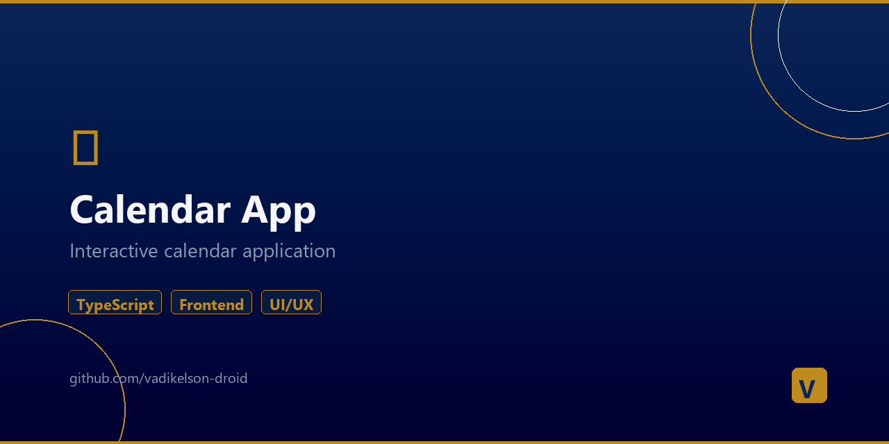

# 📅 Calendar App



> Full-stack calendar application with React frontend and Node.js backend.

## Tech Stack

### Frontend
- **React** + TypeScript
- **Vite** — build tool
- Component-based architecture
- Custom hooks
- Service layer for API calls

### Backend
- **Node.js** + TypeScript
- REST API (controllers, routes, middleware)
- MVC architecture
- MongoDB models

### Infrastructure
- Monorepo with npm workspaces
- Render.yaml for deployment
- Separate client/server builds

## Project Structure
```
calendar-app/
├── client/                # React + TypeScript frontend
│   ├── src/
│   │   ├── components/    # UI components
│   │   ├── hooks/         # Custom React hooks
│   │   ├── services/      # API service layer
│   │   ├── types/         # TypeScript types
│   │   └── utils/         # Helper functions
│   └── vite.config.ts
├── server/                # Node.js backend
│   └── src/
│       ├── controllers/   # Request handlers
│       ├── middleware/     # Auth, validation
│       ├── models/        # Data models
│       └── routes/        # API routes
├── package.json           # Workspaces config
└── render.yaml            # Deploy config
```

## Technologies
`TypeScript` `React` `Vite` `Node.js` `MongoDB` `REST API` `CSS3`

## Author
**Vadim Dev** — [Portfolio](https://vadikelson-droid.github.io/vadim-portfolio/)
